# InternLM2实战营第二期-笔记

## 第一节课 《书生·浦语大模型全链路开源体系》
官网地址：[书生·浦语官网](https://internlm.intern-ai.org.cn/)  
课程录播视频链接地址：[书生·浦语大模型全链路开源开放体系_bilibili](https://www.bilibili.com/video/BV1Vx421X72D/)   2024.06.05  
训练营链接：[书生·浦语大模型实战营第二期初夏专场](https://github.com/InternLM/Tutorial/tree/camp2)  
InternLM大模型地址：[InternLM 大模型](https://github.com/InternLM/InternLM/)

### 一、视频笔记  
由上海人工智能实验室青年科学家**陈恺**带来《**书生·浦语大模型全链路开源体系**》课程的分享，课程视频地址见上方链接。
        其实从本世纪初到2022年期间，研究会集中在专用模型上面，简单来说就是利用模型解决某个领域的特定任务，并且涉及领域面广泛，比如：围棋比赛、AlphaFold、语音识别、图像分类等等，最近几年的趋势大家慢慢会往通用模型去发展了，也就是说从”一对一“到”一个模型对多种任务多种模态“的转变,比如：ChatGPT从文本到文本的所有任务通过一个模型去解决多种任务，GPT-4V解决多种跨模态的任务等等，在这种趋势下，通用大模型成为了大家追逐的热点，并且相信这是通往通用人工智能的一条关键途径。

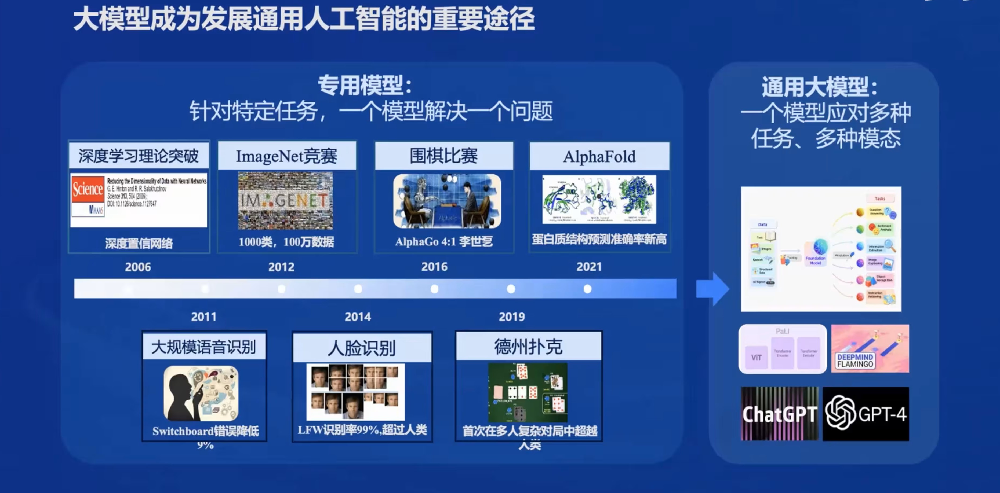

> **深度置信网络（Deep Belief Networks，DBN）**是一种生成式概率图模型，它由多层隐层构成，其中每两层隐层之间的连接形成一个受限玻尔兹曼机（RBM）。深度置信网络的几个关键点的解释：
>
> - **1.层次结构模型**：深度置信网络不同于贝叶斯网络（Bayesian networks），后者是一种**有向无环图**，用于表示变量间的概率依赖关系。而DBN是由多个RBM堆叠而成的，每个RBM都是一个**无向图模型**，用于学习数据的概率分布。
> - **2.生成式模型**：深度置信网络可以视为一个强大的生成式模型，它能够学习到数据的高阶结构。这意味着一旦训练完成，DBN可以通过其多层结构生成新的数据样本。
> - **3.逐层训练**：DBN的训练过程是逐层进行的。首先训练最底层的RBM，使其学习到输入数据的特征；然后，将这些特征作为第二层RBM的输入进行训练，依此类推。每一个RBM的隐藏层都作为下一层RBM的可见层。
> - **4.数据表示的抽象**：深度置信网络的基本思想是通过每层RBM学习数据的不同层次的表示。底层RBM可能捕捉到数据的低级特征，如边缘或角点；而上层RBM则能够学习到这些特征的组合，形成更高级的抽象概念。

>总结来说，深度置信网络是一种复杂的模型，它通过堆叠RBM并逐层训练来学习数据的深层特征，并能够生成新的数据样本，从而在许多机器学习任务中发挥重要作用。

​       接下来简单介绍下书生·浦语大模型开源历程，其中，InternLM-7B模型和全链条工具体系进行全面开源，免费商用。书生浦语大模型是一个全链条的开源体系，支持长达20万汉字的输入，是全球大模型产品中支持的最长上下文输入长度。模型具备超长上下文、推理数学代码、对话和创作体验、工具调用等能力。

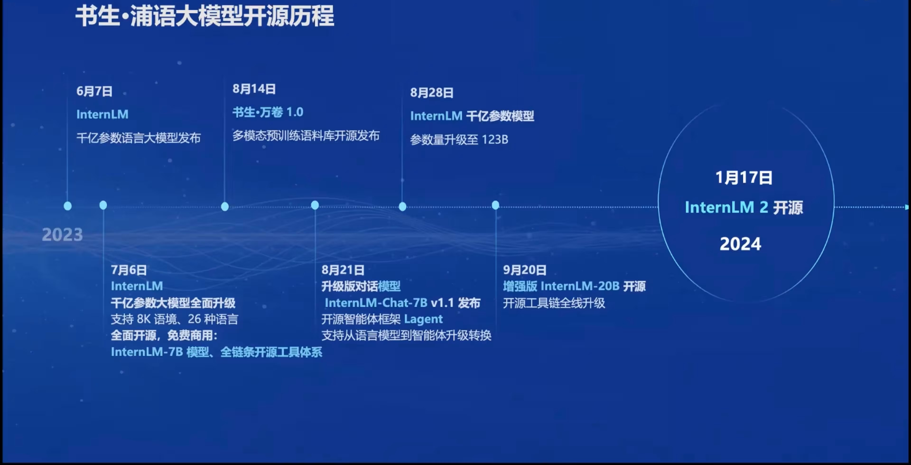

​       书生浦语大模型自发布以来，经历了快速迭代，包括升级千亿参数大模型、支持8K上下文等，直到2024年1月17日正式开源了InternLM2，相对于第一代，InternLM2有了很大的提升，也能够去解决更多真实任务和更复杂的应用场景的问题。

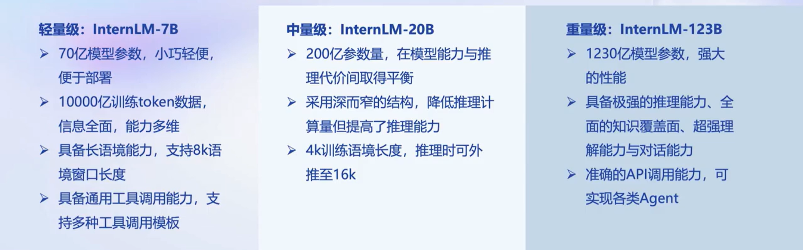

​      目前InternLM2根据不同的需求，有**InternLM2-7B**和**InternLM2-20B**规格，每个规格包含三个模型版本，InternLM2-Base、InternLM2、InternLM2-Chat，都在社区内已经开源。

> - **InternLM2-Base**: 高质量、强可塑性的模型基座，是模型进行深度领域适配研究的起点
> - **InternLM2**：在Base基础上，在多个能力进行了强化，评测过程中表现优异，保持了很好的通用语言能力，官方推荐在大部分应用中考虑选用的优秀基座
> - **InternLM2-Chat**：经过了SFT和RLHF，面向对话交互进行看优化，具有很好的指令遵循、共情聊天和调用工具的能力。

​       回到语言建模的本质，我们都知道大模型它本质上在做语言建模这件事情，也就是说我们通过给定的Context，预测接下来的Token，这里面最关键的就是我们要有高质量的语料，让模型能够学会更好的建模能力。

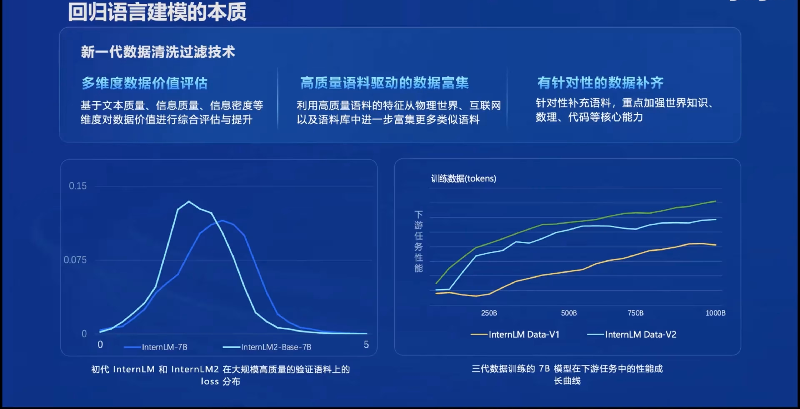

​       上面左边图其实是我们初代的**InternLM**和**InternLM2**在大规模高质量的验证语料上的**loss**（损失）分布，我们可以发现**InternLM2**基座模型整体的这种分布在左移，说明**InternLM2**的语言建模能力比初代强很多的；右边图其实也是随着我们训练数据的升级，下游任务的性能的变化，我们可以看到，可以采用更少的语料达到上一代模型相同语料的效果。

**书生·浦语2.0（InternLM2）**的主要亮点和**InternLM-20B**大模型性能评测图

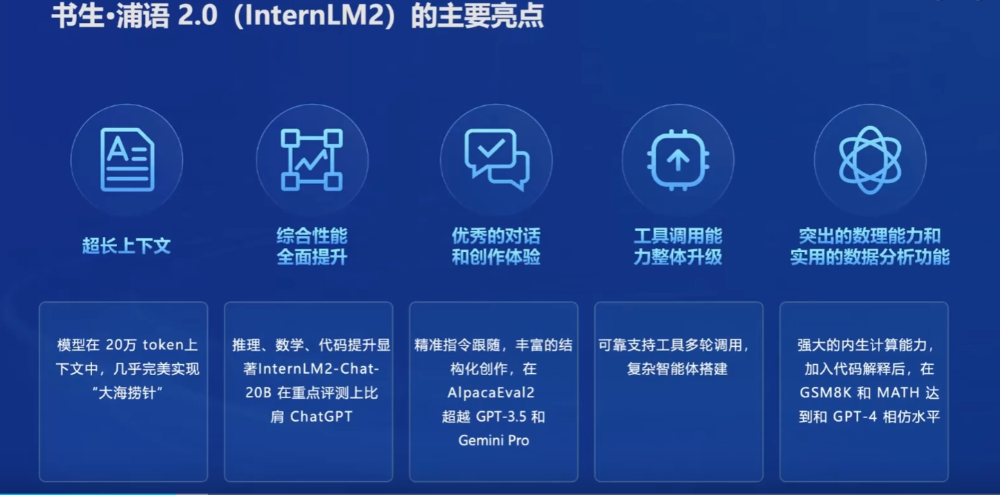

​      InternLM2性能全方位提升，在推理、数学、代码等方面性能提升的尤为显著，综合性能达到同量级开源模型领先水平，其中20B甚至可以比肩GPT-3.5的水平。应用体现在比如AI助手，共情关怀对话，富有想象力的创作，Lagent工具调用能力，强大的内生计算能力，配合代码解释器在典型的数学评测集上GSM8K和MATH上运算精度有着显著的提升表现，实时的数据分析功能（写代码使用matplotlib画出折线图）。

​       从**模型到应用的典型流程**，我们可能会面临不同复杂的业务场景，如果直接使用模型去解决，可能无法满足我们的业务需求，所以这个时候就可能需要针对业务需求，整理并且预处理业务相关数据集进行模型微调；如果业务场景简单，就可以直接使用“Prompt Engineering（提示词工程）”来解决问题，甚至可能有些应用场景需要和外界环境进行感知交互，比如实时推荐，调用API，与已有数据库交互等，我们可以构建一个Agent智能体来评测它的表现。

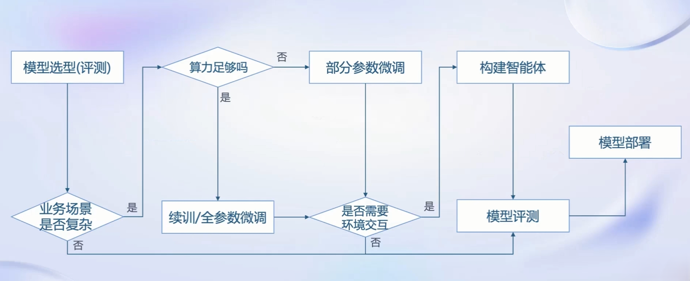

​        简单来说，完整的流程就是**模型选型（OpenCompass思南大模型）**—**数据集（书生·万卷**）—**参数微调（XTuner）**—**构建智能体（Lagent和Agentlego）**—**模型评测（OpenCompass）**—**模型部署(LMDeploy)**。

​       算力足够就全参微调，算力不够可能就选择LoRA（低秩矩阵）微调等方式。微调方式主要包括：Prefix Tuning，Prompt Tuning，P-tuning，LoRA，QLoRA，Adapter Tuning等，这些方法各有各的特点和适用场景，选择合适的微调方法可以有效的将预训练模型适配到特定的任务或数据集上，实现更好的性能和效率。

**书生·浦语全链条开源工具开放体系**

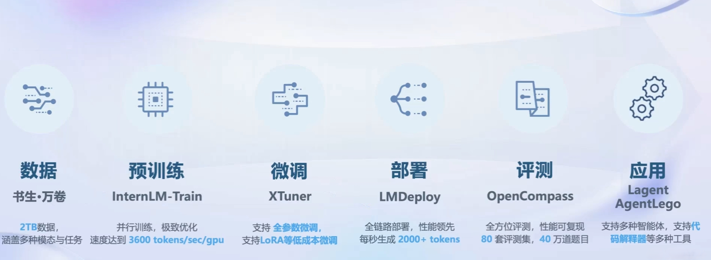

OpenDataLab数据集获取：[OpenDataLab](https://opendatalab.org.cn/)

- **数据集**：[万卷1.0多模态语料](https://github.com/opendatalab/WanJuan1.0) 书生万卷1.0和CC数据集，支持迭代。

- **预训练框架**：[InternLM-Train支持高可扩展性训练](https://github.com/InternLM/InternLM) 修改配置文件即可训练。

- **微调框架**：[XTuner适配不同微调策略和算法](https://github.com/InternLM/xtuner) 内置LoRA、QLoRA等多种微调算法。

- **部署工具**：[LMDeploy支持高效部署](https://github.com/InternLM/lmdeploy) 内置INT4，INT8等量化实现。

- **评测工具**：[OpenCompass](https://github.com/open-compass/opencompass) 全面的评测体系，已经适配了超过100个评测集，是国内最完善的评测体系之一。

- **智能体框架**：[Lagent](https://github.com/InternLM/lagent) 支持多类型的智能体、多种LLM模型。

**数据集**
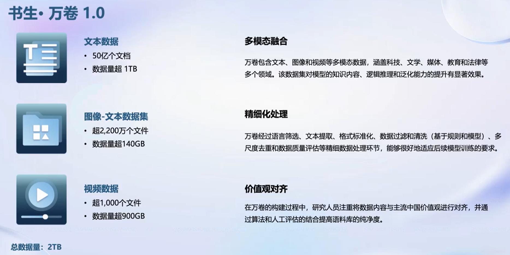

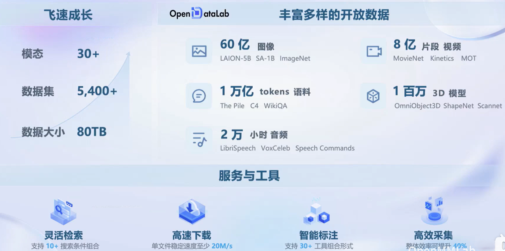

总结下来，高质量的海量数据集尤为重要，决定着模型的输出是否符合业务需求，我们可以花费较多的精力在数据集的准备和预处理上。

**InternLM-Train**预训练框架

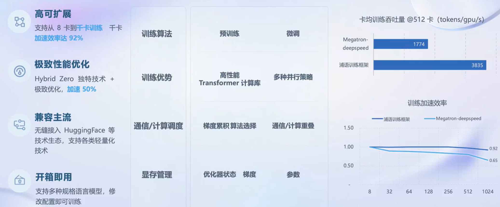

修改配置文件，即可实现不用模型，不同训练数据集的训练。

**XTuner** 框架微调

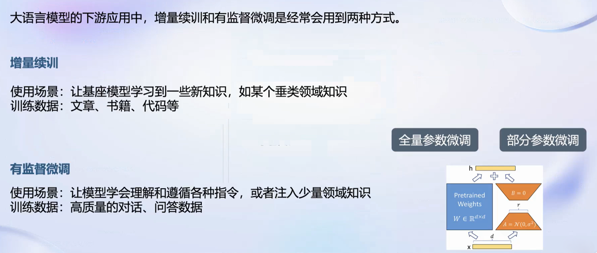

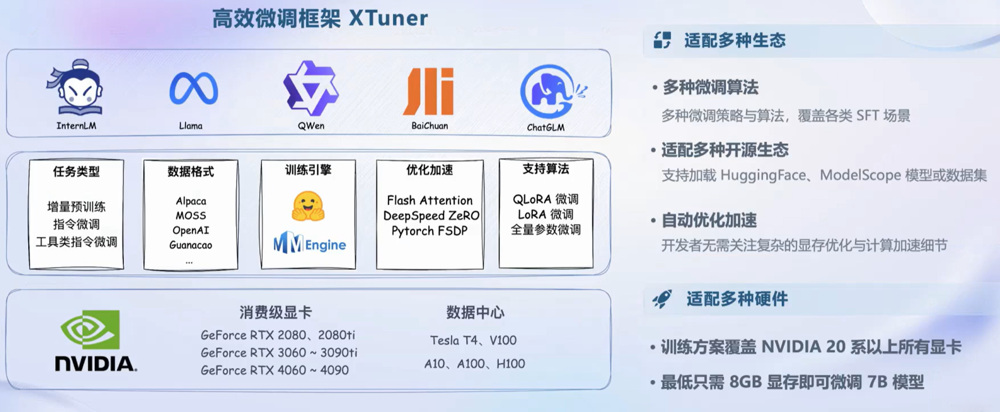

​       在下游任务中，增量续训和有监督微调是经常用到的两种方式，**增量续训**：使模型学习到一些新知识，比如某个垂直领域的知识，训练数据可以使文章，书籍，代码等。**有监督微调**：让模型学会理解各种指令进行对话，训练数据是高质量的对话，问答数据等，第一张图右下角是LoRA的示意图（其实就是通过固定模型的绝大部分参数，通过放开或者引入少部分参数，能够降低整体一个微调成本）。

**LMDeploy** 部署

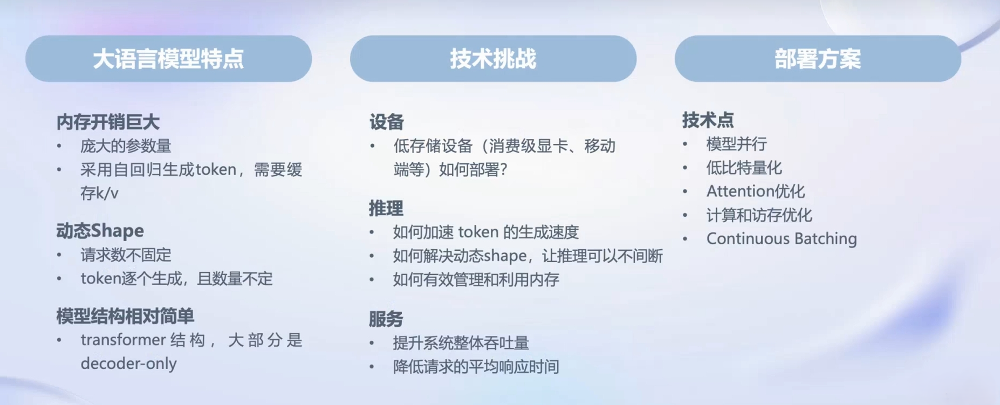

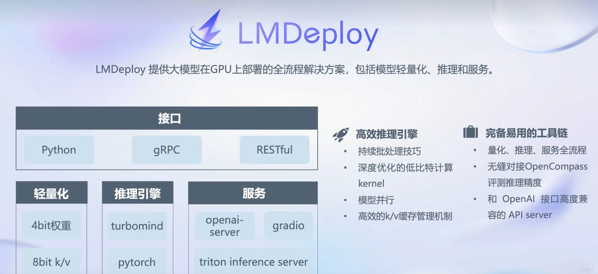

**OpenCompass2.0**思南评测工具，被Meta推荐

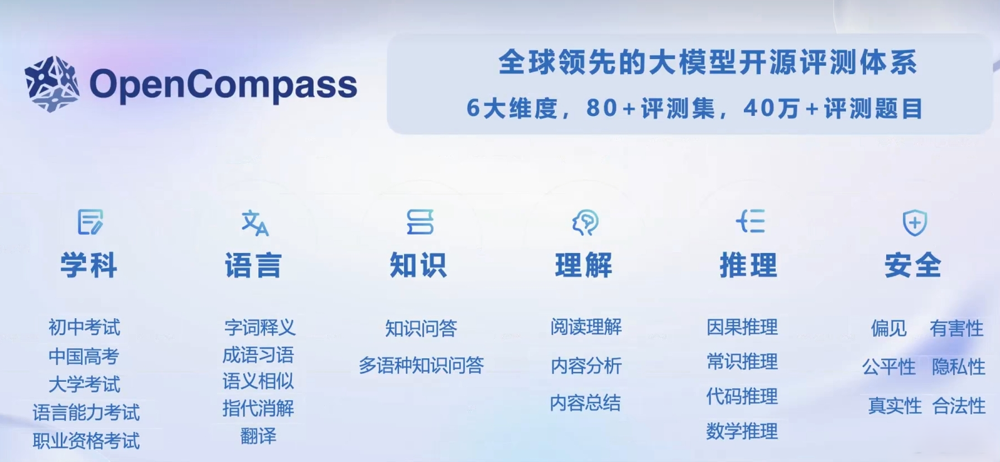

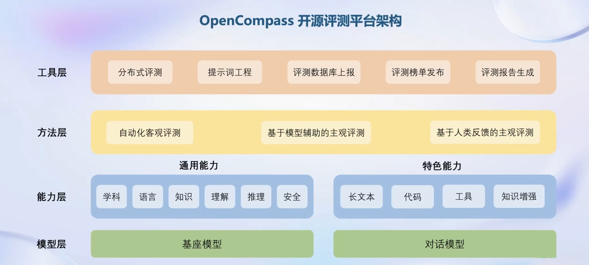

包括CompassRank性能榜单（LLM，多模态大模型等榜单）、CompassKit大模型评测全栈工具链、CompassHub高质量评测基准社区。助力大模型产业发展和学术研究。其实我们通过评测体系发现几个较为显著的问题：

- 模型真实的整体能力仍然有很大的提升空间。
- 复杂推理较依赖模型的尺寸，复杂推理仍然是短板。
- 在语言类知识这类“文科”维度，中轻量级和重量级及商业模型差距较小。更多的问题还是“理科”能力，数学、推理、代码等维度上性能依赖模型尺寸大小。
- 模型的主客观的性能需要综合参考，需要夯实模型客观能力基础，更需要在用户偏好和对话体验上下功夫。

**Lagent智能体**框架

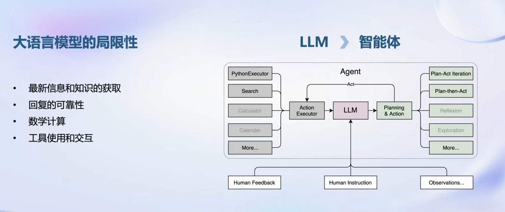

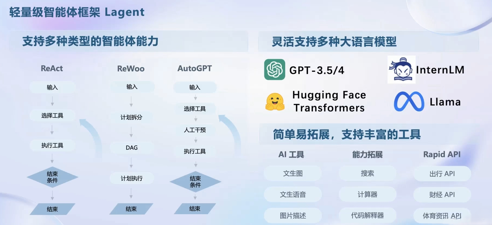

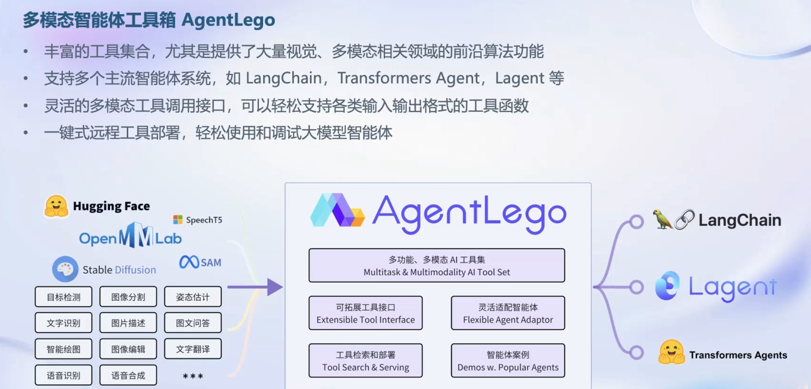

### 二、InternLM2 技术报告笔记

InternLM2 技术报告地址：[InternLM2 技术报告](https://arxiv.org/pdf/2403.17297)

#### 1.背景

InternLM2是由上海人工智能实验室、商汤（SenseTim）集团、香港中文大学和复旦大学共同开发的一款开源大型语言模型（LLM）。该模型在多个方面超越了其前身，包括在六个维度和30个基准测试中的全面评估、长文本建模和开放式主观评估中的性能表现。InternLM2采用了创新的预训练和优化技术，以实现卓越的性能。

重点介绍了InternLM2这个开源大语言模型在6个维度和30个基准的全面评估下超越了其前身，InternLM2有效捕捉长期依赖，预训练的Token从4K扩展到32K，并且通过有监督微调（SFT）和一种基于人类反馈的新型条件在线强化学习方法（COOL RLHF）策略进一步校准，以解决人类偏好冲突和奖励策略滥用问题。

#### 2.特点

大模型的发展包括预训练、监督微调（SFT）和基于人类反馈强化学习（RLHF）等主要阶段。关键点包括

- InternLM2开源且展示卓越性能
- 长序列任务表现出色，设计了带有200k的上下文窗口
- 提供丰富且全面的综合数据准备指导，有助于社区更方便的训练LLM
- 引入新的RLHF训练技术，显著提高InternLM2在各种主观对话评估中的表现。

模型使用了轻量级的高效预训练框架InternEvo进行训练，该框架使我们能在签个GPU扩展模型训练，是用过数据，张量，序列和管道并行技术实现这一点。显著较少的训练时的内存占用；减少通信开销；通信-计算重叠优化整体系统性能；长序列训练；容错性等特点。

模型结构采用的是在Transformer架构基础改进的版本LLama结构，就是将原始的**LayerNorm**替换为**RMSNorm**，并且采用**SwiGLU**作为**激活函数**，从而提高训练效率和性能。

tips：

LayerNorm（层归一化）和RMSNorm（均方根层归一化）的公式及相关解释说明。LayerNorm 的关键思想是对单个样本中的所有激活值进行归一化，不是在整个批次中进行归一化,有助于减少不同层输出分布的变化，从而有助于稳定训练.

**LayerNorm公式**如下:  

  

$x$ 是网络层的输入。  
$\mu$ 是输入特征的均值。  
$\sigma$ 是输入特征的标准差。  
$\gamma$ 和 $\beta$ 是可学习的参数，分别用于缩放和平移归一化后的数据。

**RMSNorm公式**如下： 

$x$ 是网络层的输入。  
$N$ 是输入特征的数量。  
$x_i$ 是输入特征向量中的第 $i$ 个元素。  
$\gamma$ 是一个可学习的缩放参数。

#### 3.预训练

详细介绍预训练数据、预训练设置和预训练三个阶段的内容。

基于当前很多开源模型的技术报告都不包含详细的数据处理的描述，InternLM2将介绍在通用领域的文本数据，编程语言数据和长文本数据的处理。文本数据标准化处理，根据内容类型或者语言分类，然后转成**JSONL**格式，之后再进行基于规则过滤，数据去重，安全过滤，质量过滤等数据预处理流程。代码数据转换成统一的**Markdown**格式，然后依旧是去重，质量过滤，数据质量是一个关键且模糊的方面，难以量化其对模型性能的影响。长文本数据，应用领域广，书籍摘要，长期对话等设计复杂推理的任务等。首先过滤掉低质量的长文本数据，包括长度选择基于规则的过滤器，统计过滤器，困惑度过滤器，还有就是阈值选择，不同的任务，不同的文本类型选择不同的阈值，因为普遍的阈值会错误的分类大量数据。

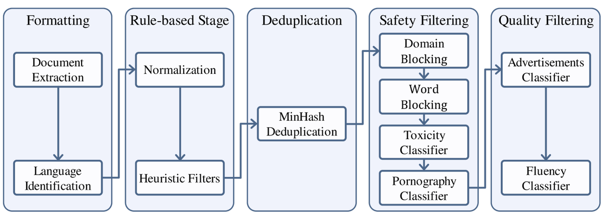

预训练设置，主要是分词和超参数，InternLM2采用了和GPT-4的tokenization方法，InternLM2预训练超参数如下：

| Params(参数量)         | n_layers(层数) | n_dim(维度) | n_kv_heads(注意力头) | n_q_per_head(每个头查询数量) | Learning Rate(学习率) | Batch size(批次大小) |
|------------------------|-------|-------|-------|-------|-------|-------|
| 1.8B                   | 24    | 2048  | 8     | 2     | 3e-4  | 4M    |
| 7B                     | 32    | 4096  | 8     | 4     | 3e-4  | 4M    |
| 20B                    | 48    | 6144  | 8     | 6     | 3e-4  | 5M    |

预训练阶段，第一阶段4k上下文预训练语料库，即采用4096个token的数据训练，超过这个长度会强制截断，剩余部分也会训练。第二阶段，长上下文训练，为适应更长序列，确保为长上下文提供有效的位置编码，将旋转位置编码（PoPE）从50000调整到1000000。第三阶段，特定任务能力的增强训练，一般指的是逻辑推理，数学问题解决和知识记忆等。

#### 4.对齐

将预训练阶段的LLM模型进一步微调，充分激发基础能力和知识，这一阶段成为“对齐”，通常包含两种阶段，分别是监督微调（SFT）和基于人类反馈强化学习（RLHF），7B和20B模型采用AdamW优化器训练。RLHF创建了代理人偏好的奖励模型，通过使用近端策略优化（PPO）为大语言模型（LLM）提供学习的奖励信号，但是仍然存在偏好冲突这一问题和奖励滥用问题，为了解决问题，InternLM2研发团队提出了条件在线的RLHF即COOL RLHF，首先引入一个条件机制来调和不同偏好，允许奖励模型根据特定条件动态的分配注意力到各种偏好上，从而最优的整合人类偏好，并且还采用了多轮在线PLHF策略，使LLM快速适应新反馈，减少奖励滥用的发生。

条件奖励模型为解决RLHF方法中通常依赖多个偏好模型来解决不同领域的偏好冲突如下图（a），条件奖励模型为不同类型的偏好引入不同的系统提示，从而有效的在一个奖励模型中模拟各种偏好。图（b）是通过利用条件系统提示来协调不同领域中的偏好数据，从而在一个单一的模型中有效的处理何种偏好。

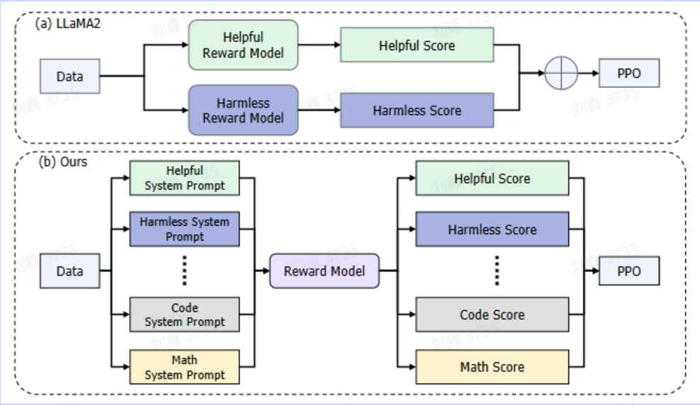

如图（b）所示，条件奖励模型使用系统提示来融合不同领域的数据，该模型是基于预训练的SFT模型，已经学会了遵循人类指令，系统提示也是知道奖励分数与不同场景中不同偏好对齐的关键工具，这使得奖励模型没有牺牲整体准确性情况下，可以统一管理矛盾和复杂的人类偏好。

获取长上下文代码数据的流程图

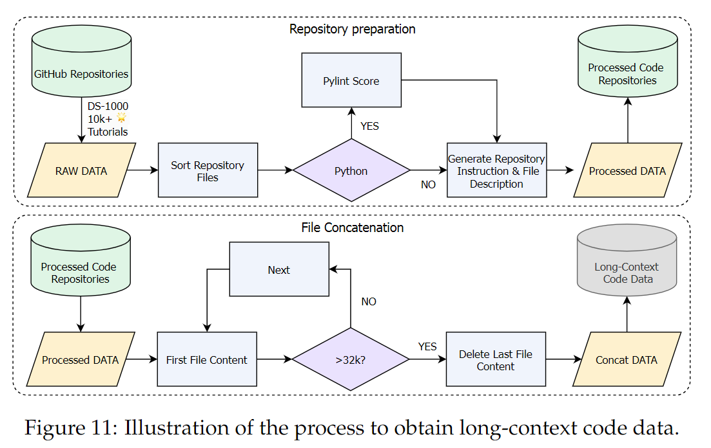

InternLM2进行了增强训练后从**编程**（HumanEval和MBPP等基准数据集）、**推理**（MATH、GSM8k、SummEdits和BBH）、**问答**（HellaSwag、PIQA、WinoGrande、OpenBookQA、NaturalQuestions和TriviaQA）、**考试**（MMLU、AGIEval和C-Eval）等复杂推理任务对于之前未进行增量训练的版本有了显著提升。

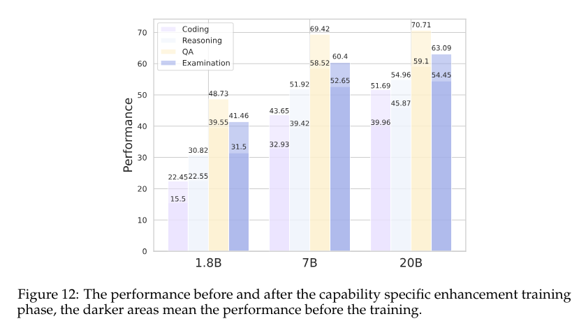

​       这篇详细的InternLM2的技术报告详细的介绍了InternLM2大语言模型的整个训练过程，基于2T以上的高质量训练数据进行训练，这些信息对于我们准备训练数据集和有效的微调大模型提供了参考价值！
